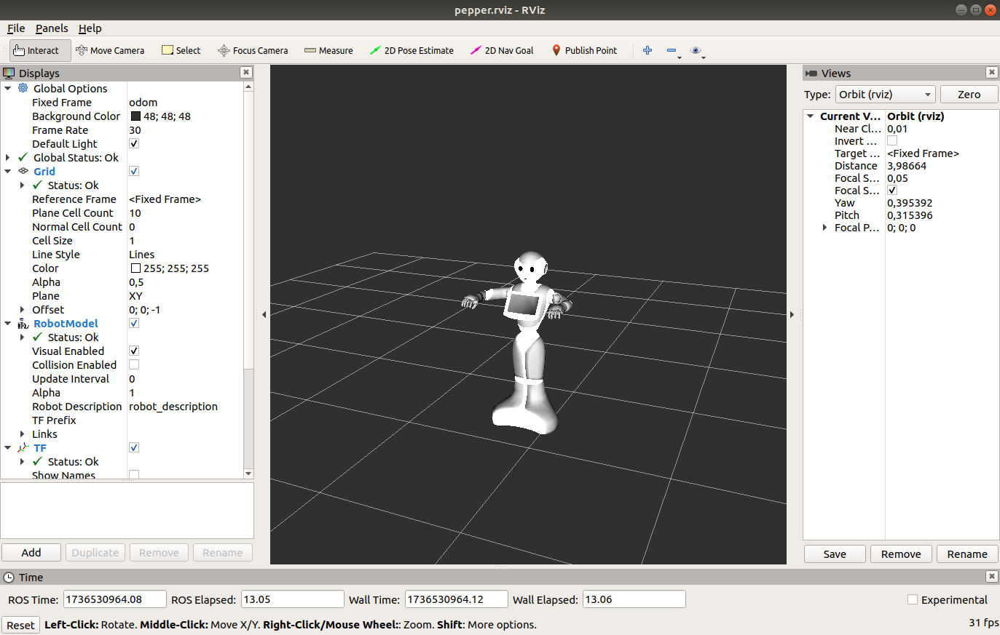
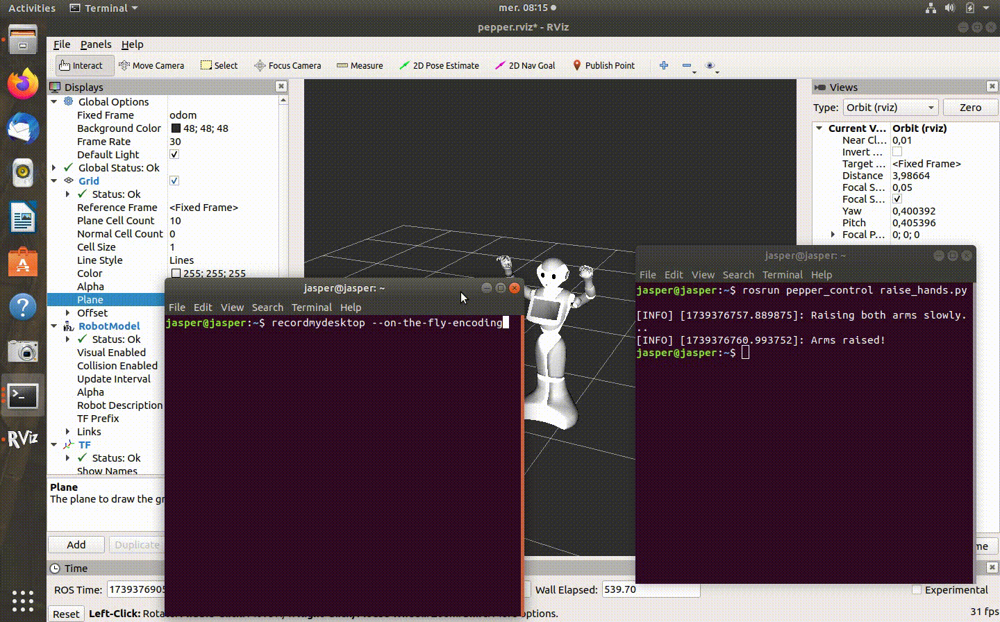
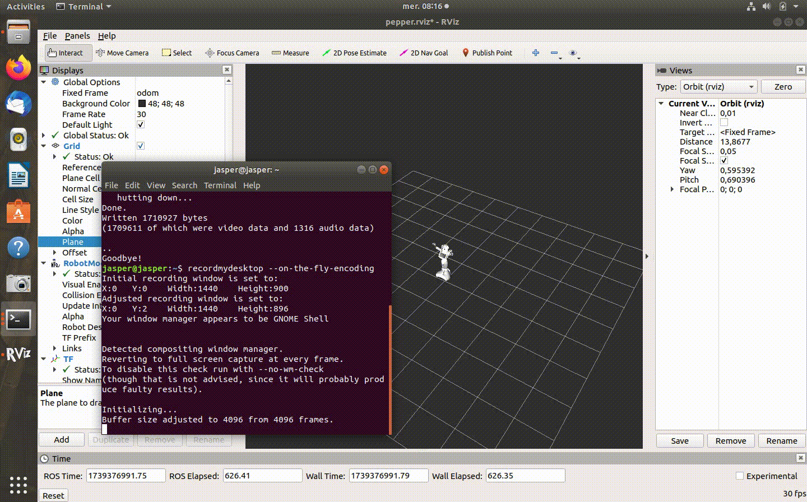

# Pepper Virtual Robot 

The pepper_virtual_sim ROS package provides a comprehensive framework for working with 
the Pepper humanoid robot in a virtual environment Rviz, Gazebo. It includes components for managing 
the robot's virtual hardware interface, controlling its joints, and publishing its state for visualization and control. 
This package is specifically designed for situations where a virtual version of Pepper is needed, such as simulation environments, 
controller testing, or AI integration, without requiring a physical Pepper robot.

# Note

This package was specifically designed, developed, and tested to work exclusively with Ubuntu 18.04 LTS. 
This is because the Virtual Hardware Interface relies on the [Controller Manager API](https://docs.ros.org/en/melodic/api/controller_manager/html/c++/classcontroller__manager_1_1ControllerManager.html) which is only compatible with this version of Ubuntu.

If you wish to adapt this package for other Ubuntu distributions below Ubuntu 18.04, you will need to modify the virtual_hw_interface.cpp file 
located in the pepper_vhw_interface package. Specifically, you must update the imports to use the Controller Manager API supported by your target Ubuntu distribution. 
However, please note that such changes are not recommended, as they may lead to compatibility issues or unexpected behavior.

# Pre-requisites
- [ROS Melodic compatible with the version of ubuntu 18.04 LTS](https://wiki.ros.org/melodic/Installation/Ubuntu)
- Python 2
- Rviz, Gazebo (comes pre-installed with ros-desktop-full)

# Installation

    After the installation of ROS Melodic you need to install additional packages for the pepper robot
    
    Open terminal and run:
    
    - sudo apt update
    - sudo apt upgrade
    
    Install Pepper-ROS required packages:
    - sudo apt-get install ros-melodic-driver-base ros-melodic-move-base-msgs ros-melodic-octomap ros-melodic-octomap-msgs ros-melodic-camera-info-manager ros-melodic-camera-info-manager-py
    
    Also Pepper 3D Meshes:

    - sudo apt-get install ros-melodic-pepper-.*

## Usage
After the installation of the necessary requirements ROS Melodic and Pepper requirements.
Now we need to install and set the package of the virtual pepper robot under the workspace using the catkin tool.
       
    Creating a catkin workspace: 

      - mkdir pepper_ws
      - cd ~/pepper_ws
      - mkdir src
      - cd src

    Now move or copy this package content into the src folder, or you can use the git clone command with a link of the repository from above. 
    After you finish run this commands:

      - cd ~/pepper_ws
      - catkin_make

## Demo
To use the package and test the robot, open the terminal and run launch command.

     Open the terminal and run this command

     roslaunch pepperv_bringup pepperv_bringup.launch

     What this command does:
        * It initializes essential components like robot joints controllers and communication with the hardware virtual interface.
        * It starts the virtual Pepper robot with the RVIZ Visualisation tool by launching necessary ROS nodes.
        * It sets up the simulation environment for the robot, allowing interaction through ROS topics and services.

The package includes two Python files, one for moving the robot's hands and another for controlling the wheels, which allow you to view how the robot moves inside RVIZ.
To use the raise_hands.py, Open another terminal and run this command

    rosrun pepper_control raise_hands.py

If you want to see the robot moves, Open another terminal and run this command

     rosrun pepper_control move_wheels.py

# Reference
1. http://wiki.ros.org/ROS/Tutorials
2. https://github.com/ros-visualization/rviz.git
